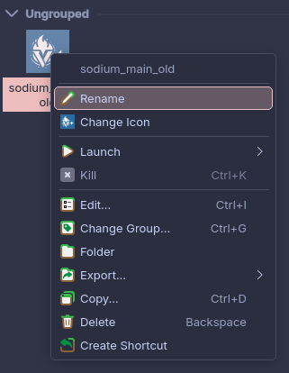
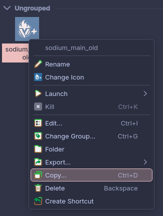
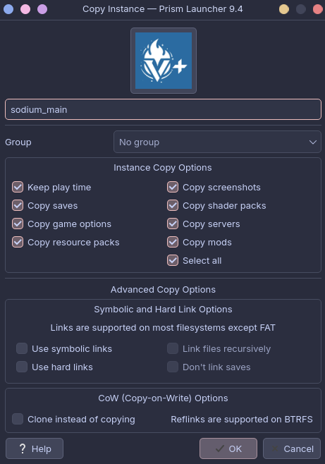
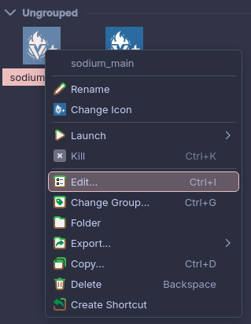
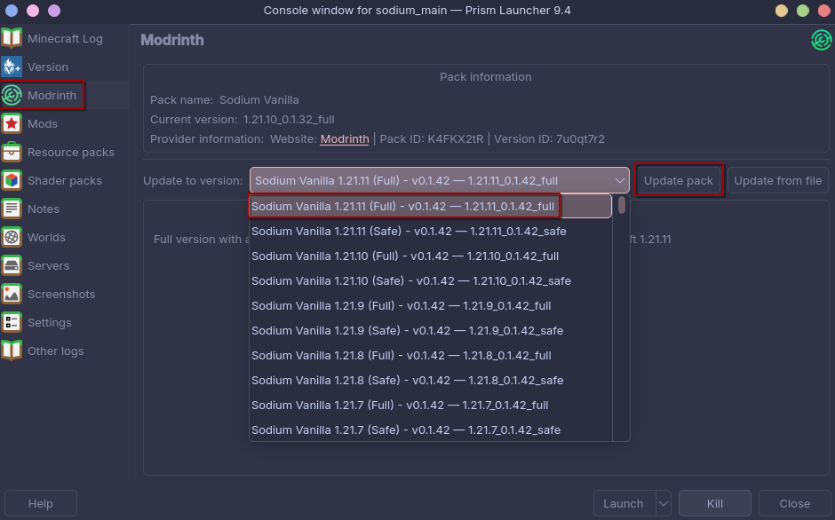

# Updating the Modpack

This guide shows you how to update your Sodium Vanilla modpack to a new version in **PrismLauncher**.

## Steps

### 1. Rename your current instance as backup

Rename your existing instance by adding `_old` to the name. This keeps it as a backup in case anything goes wrong.

### 2. Open Copy Settings

Click `Copy...` on your instance.

### 3. Copy Settings configuration

Remove the `_old` from the copy name, and click `OK`.

### 4. Open Edit Settings

Click `Edit` on your instance.

### 5. Update to target version

Go to `Modrinth` and select the target version from the `Update to version:` dropdown and click `Update pack`.

### 6. Sync mods (older PrismLauncher versions)

If you want to be safe or are using an older version of PrismLauncher, repeat steps 4 and 5 again since it sometimes only updates the modpack version without downloading the needed mods.

---

That's it! Your modpack is now updated to the latest version with all mods synced correctly.
